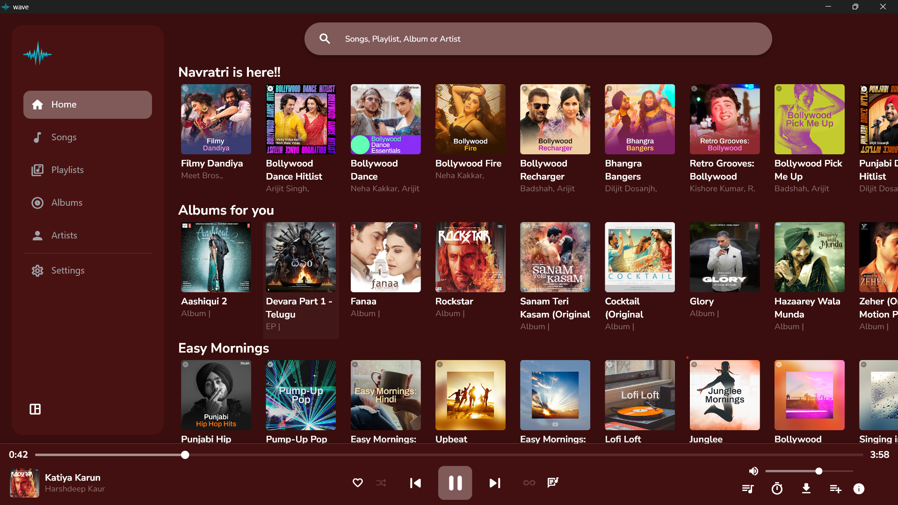
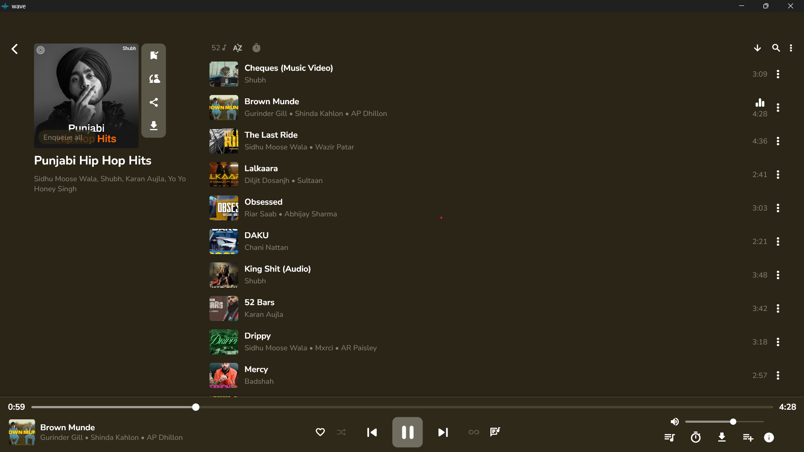

# Wave Music App
================

## _A Music App built with Flutter for Windows and Mobile devices, featuring a well-constructed UI, dynamic themes, and various music-related features._

## Features
------------

* **Albums**: View and play songs from various albums
* **Song Mixes**: Discover and play curated song mixes
* **Downloadable Songs**: Download your favorite songs for offline playback
* **Search Option**: Quickly find songs, albums, and artists
* **Dynamic Themes**: Switch between Light, Dark, and System themes
* **Playlist Creation**: Create and manage your own playlists
* **Liked Songs**: Mark and view your favorite songs

## Screenshots
-------------

### Home Screen

### Album Mixes Screen

## Getting Started
-------------------

To get started with the Music App, follow these steps:

### Prerequisites

* Flutter installed on your system
* A Windows or Mobile device for testing

### Installation

1. Clone the repository using `git clone https://github.com/Asim-Sidd02/WaveMusic.git`
2. Navigate to the project directory using `cd WaveMusic`
3. Run `flutter pub get` to install dependencies
4. Run `flutter run` to launch the app on your device

### Usage

1. Launch the app on your device
2. Explore the various features and screens
3. Create playlists and mark your favorite songs

## Themes
---------

The Music App features three dynamic themes:

* **Dynamic Theme**: A dynamic themes which chages according to songs
* **Light Theme**: A bright and colorful theme
* **Dark Theme**: A dark and sleek theme
* **System Theme**: A theme that follows the system's theme settings

To switch between themes, go to the app's settings screen.

## Contributing
--------------

Contributions are welcome! If you'd like to contribute to the Music App, please follow these steps:

1. Fork the repository using `git fork https://github.com/your-username/music-app.git`
2. Create a new branch using `git branch feature/your-feature`
3. Make changes and commit them using `git commit -m "Your commit message"`
4. Push your changes using `git push origin feature/your-feature`
5. Open a pull request to merge your changes into the main branch

## Author

- **Asim Siddiqui**
- **Contact Information**
  - Email: asimsiddiqui8181@gmail.com
  - LinkedIn: [Asim Siddiqui](https://www.linkedin.com/in/asim-siddiqui-a71731229/)
  - Portfolio: [Asim Sidd](https://asimsidd.vercel.app/)

## License
----------

## License

This project is licensed under the MIT License. See the [LICENSE](LICENSE) file for details.
